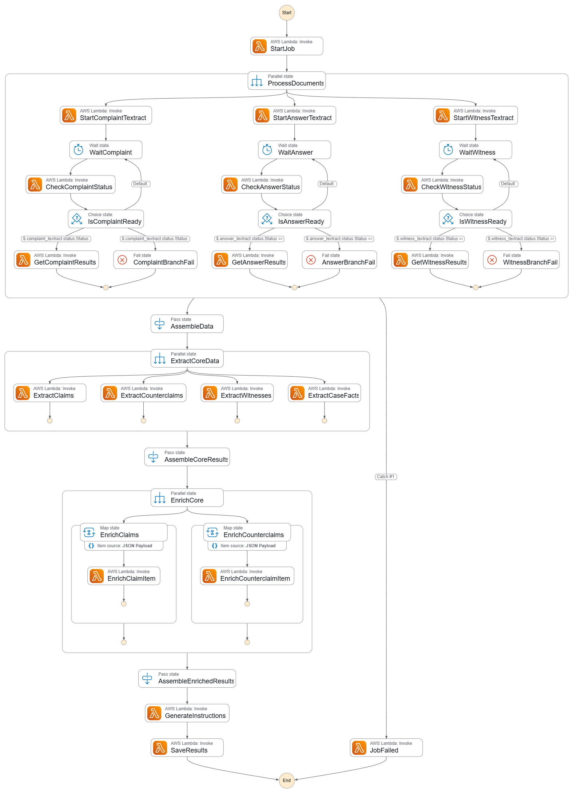

# Jury Gen Workflow

This document explains the Step Functions state machine and what each Lambda does, plus how to run the flow’s components locally.

## State Machine Overview

- Definition: see `terraform/step_functions.tf:1`.
- High‑level diagram (exported from the AWS Console):

### Execution Flow

1. StartJob (`lambdas/job_start`)
   - Initializes `job_data` (e.g., `jury_instruction_id`, input file S3 paths).
2. ProcessDocuments (Parallel)
   - Three branches run Amazon Textract on the uploaded documents in parallel.
   - Complaint branch:
     - `textract_start` → `Wait 30s` → `textract_check_status` → Choice:
       - `SUCCEEDED` → `textract_get_results` (produces `complaint_chunks`)
       - `FAILED` → Fail state
   - Answer branch: same pattern, produces `answer_chunks`.
   - Witness branch: same pattern, produces `witness_chunks`.
3. AssembleData (Pass)
   - Collects `complaint_chunks`, `answer_chunks`, `witness_chunks`, and `job_data` into a single object.
4. ExtractCoreData (Parallel)
   - ExtractClaims: `extract_legal_claims` on complaint chunks (`claim_type="claims"`).
   - ExtractCounterclaims: `extract_legal_claims` on answer chunks (`claim_type="counterclaims"`).
   - ExtractWitnesses: `extract_witnesses` on witness list chunks.
   - ExtractCaseFacts: `extract_case_facts` using complaint, answer, and witness chunks.
5. AssembleCoreResults (Pass)
   - Collates claims, counterclaims, witnesses, and case_facts with the original chunks.
6. EnrichCore (Parallel with Map)
   - EnrichClaims: map over each claim via `enrich_legal_item` (add damages from complaint, defenses from answer).
   - EnrichCounterclaims: map over each counterclaim via `enrich_legal_item` (add damages from answer).
7. AssembleEnrichedResults (Pass)
   - Merges enriched outputs and chunks into a single object.
8. GenerateInstructions (`generate_instructions`)
   - Produces the final list of tailored jury instructions using enriched items + case facts.
9. SaveResults (`job_save_results`)
   - Persists outputs to DynamoDB.
10. JobFailed (`job_handle_error`)
   - Records failure context when any branch fails.

## Lambda Responsibilities

### Job / Control
- `lambdas/job_start/main.py`
  - Seeds `job_data`, may write initial status row to `JuryInstructions-*`.
- `lambdas/job_save_results/main.py`
  - Writes final results to DynamoDB.
- `lambdas/job_handle_error/main.py`
  - Persists failure details.

### Textract
- `lambdas/textract_start/main.py`
  - Starts Textract on a staged document in the processing bucket.
- `lambdas/textract_check_status/main.py`
  - Polls a Textract job and returns status.
- `lambdas/textract_get_results/main.py` (Docker)
  - Pages Textract results, chunks text, returns `*_chunks`.

### Core Extraction (Bedrock)
- `lambdas/extract_legal_claims/main.py`
  - Input: `{ "chunks": [...], "claim_type": "claims"|"counterclaims" }`
  - Pipeline: extract raw → deduplicate → match to DynamoDB `Claims-*`.
  - Output: `[ { "claim_id": str|null, "raw_texts": [..] }, ... ]`.
- `lambdas/extract_witnesses/main.py`
  - Input: `[ "chunk", ... ]` (witness list).
  - Output: `[ { "first_name": str, "last_name": str }, ... ]`.
- `lambdas/extract_case_facts/main.py`
  - Input: `{ complaint_chunks: [...], answer_chunks: [...], witness_chunks?: [...] }`.
  - Output: consolidated case facts string.

### Enrichment
- `lambdas/enrich_legal_item/main.py`
  - Map state over each item.
  - Claims: add damages (complaint) + defenses (answer).
  - Counterclaims: add damages (answer).

### Synthesis
- `lambdas/generate_instructions/main.py`
  - Input: `{ claims: [...], counterclaims: [...], case_facts: "..." }`.
  - Joins with `StandardJuryInstructions-*` to emit instruction objects.

## Local Development

### Get Real Inputs From Step Functions History
- Extract the exact payload Step Functions sent to each Lambda:
  - `python scripts/extract_lambda_inputs.py --history examples/one/sfn_events.json --lambdas enrich_legal_item extract_case_facts extract_legal_claims extract_witnesses generate_instructions --outdir examples/one/inputs --write-files`
  - Repeat for `examples/two/sfn_events.json`.

### Run Lambdas Locally (CLI)
- `python scripts/run_lambda_local.py --lambda extract_legal_claims --example one --region us-east-1`
  - Auto-sets DynamoDB env vars for dev tables when needed.
  - Hot‑reloads lambda modules on every run.

### Run Lambdas Locally (Web UI)
- `streamlit run scripts/ui_app.py` (or `uvx streamlit run scripts/ui_app.py`)
  - Pick example, lambda, and an input file (or All) to run.
  - Live logs stream in the UI.
  - Region is inferred from the example’s ARN; tables default to `*-dev`.
